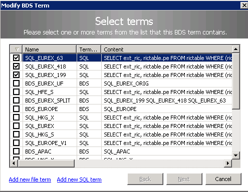

# How can I get a list of all RICs available on Elektron Realtime?


***Knowledge Prerequisite** – Must have an understanding of a Reuters streaming API such as
EMA, RFA and be familiar with consuming OMM Market Price data (see end of article for links to relevant tutorials)* 

Developers often ask 'how can I get a list of all the RICs available?' - without realising that our realtime feed Elektron carries millions of instruments (over 50 million at the time of writing). Instruments expire and new ones are added all the time. So, if they were to get a list all the RICs available, the volume would no doubt be overwhelming.

However, the Thomson Reuters Elektron Edge device (see the <a href="https://developers.thomsonreuters.com/sites/default/files/API_ConceptsGuide_1.pdf" target="_blank">API_Concepts Guide</a> if you are not familiar with the Edge device) does have a facility that allows the developer to make a Criteria Based Request (CBR) for a list of RICs matching a set of specified criteria - also known as a BDS (Broadcast Data Stream).  
For example you might want to discover:
* a list of all Treasury Debt Futures Instruments for the Eurex Exchange  
* or you may want all the RICs for Cash Options and Futures Options for the Hong Kong  Exchange 
* or even a list of all the RICs from all the APAC exchanges

The list of RICs is delivered in a SymbolList (the OMM replacement for the legacy Chains mechanism). This is where the application makes a SymbolList Domain request using a key name and the server responds with a Map structure containing the corresponding RICs.

So, for example if I were to make a SymbolList request for .AV.O (Top 25 most active RICs on Nasdaq) from Elektron I would receive back something like this:


As you can see the list of RICs is returned as the Key value for each Map entry. In this particular SymbolList we also get a Field showing the Ranking for that instrument.

### Defining your RIC selection criteria

I mentioned earlier that you can make a Criteria Based Request by specifying a set of values to match against. How do you go about doing this and what types of Criteria can you specify?

#### Technical Prerequisites ###
To define the match criteria you will need access to the Elektron Edge console application. So, the first thing  you need to do is speak to your Market Data team and confirm that they will be able to create what is known as a **BDS Term** on your organisation's Edge devices.

#### Creating a BDS Term
A BDS Term is made up of one or more SQL Terms, other BDS Terms and also File Terms.   
For the subject of this article i.e. discovering a list of RICs matching some selection Criteria, the SQL Term is the most appropriate. Using a File Term (a file populated with a list of RICs) would require prior knowledge - so does not make sense in terms of discovering RICs.

#### Creating a SQL Term
A SQL Term is a SQL statement that is used to query the Elektron Edge database. The resulting RIC list obtained from the query is used as the response for the criteria based request.   
There a limited set of fields that can be used to form the SQL query for example:

| SQL Field            | User Input Type                      | Notes                                                                                          |
|-----------------|------------------------------------|------------------------------------------------------------------------------------------------------|
| Exchange ID | Numeric value | Values can be found in the enumtype.def file that comes with each TR API - in the Enum definitions for RDN\_EXCHD2 and RDN\_EXCHID |
| Exchange ID (Name) | Text based equivalent                | Can be selected using the SQL query editor (see below)                                              |
| Record Type    | Numeric value                | Type of record e.g. Debt, Futures, Options etc (see link below)            |
| Record Type (Name)    | Text based equivalent                | Type of record e.g. Debt, Futures, Options etc (see link below)            |
| RIC Name    | Text                 | Wildcard characters as detailed in table below            |


You can find an explanation of Record Types in the post about <a href="https://community.developers.thomsonreuters.com/questions/7847/what-are-the-differences-in-recordtype-values.html" target="_blank">Record Type values</a> on this website

##### RIC Name Wildcards
The RIC Name matching criteria can use the following Wildcarding symbols:

| Description     | Character   | Example | Meaning     |
|-----------------|-------------|---------|-------------|
| Single Character  | '\_' | IBM.\_ |All RICs with “IBM.” as prefix and followed by any single characters. e.g. IBM.O, IBM.N, IBM.t |
| Multiple characters | '%'|  %.HK  | All RICs from HK exchange with “.HK” as suffix |
| Range  | []         | 800[2-6].HK | Represents RICs 8002.HK, 8003.HK, 8004.HK, 8005.HK, and 8006.HK | 
| Negate    | '^'     | _[^]%       | All RICs that are not chain records (i.e. not 0#GC:, 0#.FTSE, 1#.HSI, etc)|

### Using the Edge console
Access to the Edge console is usually limited to your site's Market Data admin team. However, if they are not familiar with its use, the following should help.

BDS terms and SQL terms can be created via the Task menu of the Edge console application.


Since your BDS Term is going to be made up of one or more SQL Terms, it makes sense to Create your SQL Terms first.


The above shows the fuller set of Criteria / fields you can match on when constructing your SQL term. More details on these can be found in the <a href="https://customers.reuters.com/a/support/paz/pazDocs.aspx?dId=564059" target="_blank">Elektron Edge Device User Guide</a>   

So, let us go ahead and create a SQL Term:


In the above example I have a SQL query which will select all RICs from ICE(758), Amsterdam Exchanges(77) and the Stockholm Exchange (70)

Next, I am going to save the SQL Term as 'SQL\_EUROPE\_V1' :


Now that I have a SQL Term created I can go ahead and Create the BDS Term that will use the SQL Term:   


Here I can select the terms that will make up my new BDS Term. I just going to select the SQL\_EUROPE\_V1 Term that I created above. However, as you can see it is possible to select multiple SQL Terms as well as other existing BDS Terms - allowing you to make your selection criteria as simple or as complex as required.

Finally, I am going to save this BDS Term as BDS\_EUROPE\_V1 :


So, now I have my SQL Term and a BDS Term that references the SQL Term.    
I have kept things simple, however, as explained above you can use multiple SQL Terms within a single BDS Term e.g. the following BDS Term is made of 3 SQL Terms:



#### Testing the BDS Term

To test the new BDS Term we need an application which can request and process a SymbolList Domain. All of our OMM capable API packages include a simple SymbolList example including the Elektron Message API - which should be the shortest in terms of lines of code. So, for brevity I will use the EMA Java example ***example270__SymbolList***. 

Before, I proceed I should point out that if I made a request for the above BDS\_EUROPE\_V1 Term, it would return somewhere in the region 740,000 instruments - not ideal for testing with. In view of this I created another SQL term with a much smaller range of matches as follows:


The above SQL Term will match on all RICs that begin with \'**VOD.**\' - which I attached to a new **BDS\_VOD** Term.

#### Requesting a BDS

As mentioned above I am going to use ***example270__SymbolList*** which can be found in the ```Ema\Src\examples\java\com\thomsonreuters\ema\examples\training\consumer\series200``` folder of the Elektron SDK package.

When requesting the more commonly used MarketPrice data you specify a Domain of MARKET_PRICE in the Request Messsage e.g.

```java

RFA : ommmsg.setMsgModelType(RDMMsgTypes.MARKET_PRICE)

EMA : reqMsg.domainType(EmaRdm.MMT_MARKET_PRICE) // default domain in EMA - so not explicitly required

```
However, if you look at the main() method of example270 you will note the domain for the request message is specified as MMT\_SYMBOL_LIST when creating the ReqMsg :

```java
consumer.registerClient(EmaFactory.createReqMsg().domainType(EmaRdm.MMT_SYMBOL_LIST)
    .serviceName("ELEKTRON_DD").name("BDS_VOD"), appClient, 0);

```
You will also note that I have specified **BDS\_VOD** as the name of the SymbolList that I am requesting.

Another key difference between MarketPrice data and a SymbolList is that the SymbolList response is in the form of a Map - rather than the simpler FieldList of the MarketPrice response.

IF you are familiar with OMM Map you can skip the following section and move onto the Results.   

You can read in more detail about OMM Map in the Developer Guides or API Concept Guides that come with our Elektron and RFA API packages. However, the following should provide a quick overview:   


An example of a SymbolList Refresh response trace below (truncated) should help understand the Map's structure better:

```xml
<REFRESH domainType="SYMBOL_LIST" streamId="5" containerType="MAP" flags="0x1F8 (HAS_MSG_KEY|SOLICITED|REFRESH_COMPLETE)" State: Open/Ok/None - text: "All is well">
<key serviceId="257" name="BDS_VOD"/>
    <dataBody>
        <map countHint="30" containerType="FIELD_LIST" >
            <summaryData>
                <fieldList>
                    <fieldEntry fieldId="6456" data="06"/>
                </fieldList>
            </summaryData>
            <mapEntry flags="0x00" action="ADD" key="VOD.BN" >
                <fieldList>
                    <fieldEntry fieldId="1" data="0D42"/>
                </fieldList>
            </mapEntry>
            <mapEntry flags="0x00" action="ADD" key="VOD.MW" >
                <fieldList>
                    <fieldEntry fieldId="1" data="19A1"/>
                </fieldList>
            </mapEntry>
            <mapEntry flags="0x00" action="ADD" key="VOD.SId" >
                <fieldList>
                    <fieldEntry fieldId="1" data="1AD0"/>
                </fieldList>
            </mapEntry>
            ....
            ....
            <mapEntry flags="0x00" action="ADD" key="VOD.SI" >
                <fieldList>
                    <fieldEntry fieldId="1" data="0BEB"/>
                </fieldList>
            </mapEntry>
        </map>
    </dataBody>
</REFRESH>

```
A breakdown of the above Refresh Message snippet:
* First we have the 'header' section which confirms various attributes of the Refresh including domain, unique stream ID, Status information, name and the container type
* Next we have have the Map payload which consists of a Summary section - not particularly useful in the case of a BDS response - just the Domain type repeated again. However, for something like a Level 2 OrderBook (which also uses a Map), the Summary would contain details like Currency, Trade Units, Exchange ID - i.e. values that are common to all the orders in the book
* Then we have the individual Map entrys   
    - The action of Add indicates this is a new entry that needs to be added to your local cache   
    - If this was an Update Message, it may contain entries with an action of Delete - indicating  the item has expired and should be deleted from local cache (for an OrderBook you can also receive Update actions e.g. if the price or size of an order book entry changes)
    - The Map Key for a BDS SymbolList entry is the actual RIC itself (for an OrderBook the Key could be the Order Price + Order Side)
    - The Field List contains one ore more fields relevant to the Map Entry. Here we just have a permissioning code for the RIC (for an Order Book entry it would the Price, side, size, time of order etc).

#### Result of BDS SymbolList Request

Once I had defined the **SQL\_VOD** Term and linked it to the **BDS\_VOD** term I then requested it using sample Consumer application. I made a SymbolList Request for BDS\_VOD from the ELEKTRON\_DD service and the result was as shown below:


The service name may vary for your site - it needs to be the service which delivers the Elektron Realtime data feed - often named IDN\_RDF, ELEKTRON\_DD or something similar.

As the number of RICs returned above was quite small, the complete Map arrived in a single Refresh Message. A more realistic BDS query will most likely contain a much high number of RICs and therefore these will be delivered as multi-part RefreshMsgs, where each RefreshMsg contains a subset of the RICs. The final RefreshMsg will have the Complete flag set to true, indicating that all parts have been sent and the Order Book delivery is now complete.

You will note the ```REFRESH_COMPLETE``` flag in the REFRESH trace above - as this was single self contained RefreshMsg. You can test for the final RefreshMsg in code by testing for the complete flag e.g.

```java
public void onRefreshMsg(RefreshMsg refreshMsg, OmmConsumerEvent event)
{
...
	if (refreshMsg.complete())
		System.out.println("Final RefreshMsg received");
...		
}
```

**Note**: You can make a Snapshot request for a BDS and you will receive the current list of matching RICs and the data stream will be closed off. If, however, you make a Streaming request, the stream will remain open (until you close it). You will receive Update Messages containing Map Entries with:
* Add action when any new RICs matching your Criteria become available
* Delete action when any of the previously matched RICs expire 
* Update action when the permission code for existing RICs change (a rare occurence)    

Often the Update message will contain a Map with a mixture of Add & Delete action entries - as RICs expire and new RICs are created at certain points during the day.

### Closing summary

To summarise the information above:
* The Elektron EDGE device offers a realtime RIC discovery facility 
* To use this facility you need access to the Edge Console application
* The facility is referred to as Broadcast Data Stream - BDS (also known as Criteria Based Request - CBR)
* BDS Terms can be made up of SQL Terms, File Terms and include other BDS terms
* An OMM Consumer application needs to make a SymbolList domain request using the defined BDS term name as the RIC name
* The response is sent as single or multi-part Refresh Messages (final Refresh Message has the Complete flag set to true)
* The payload consists of a Map, where each Map entry's Key is the actual RIC itself and each entry also has an action; Add, Delete or Update
* A Snapshot request will deliver a list of RICs that match the SQL Terms criteria at that point in time
* A Streaming request will continue to receive Update Messages as and when RICs expire or new RICs are created

**Additional Resources**

If you have any further questions I recommend you post them on our Developer
Forum or contact our Data Helpdesk

>   [Developer
>   Forum](https://community.developers.thomsonreuters.com/index.html)

>   [Contact Data Helpdesk](http://my.thomsonreuters.com/ContactUsNew)

**Existing Tutorials mentioned above:**

>   [RFA C++
>   Tutorials](https://developers.thomsonreuters.com/thomson-reuters-enterprise-platform/robust-foundation-api-rfa/learning)

>   [RFA Java
>   Tutorials](https://developers.thomsonreuters.com/thomson-reuters-enterprise-platform/robust-foundation-api-rfa-0/learning)

>   [EMA C++
>   Tutorials](https://developers.thomsonreuters.com/elektron/elektron-sdk-cc/learning)

>   [EMA Java
>   Tutorial](https://developers.thomsonreuters.com/elektron/elektron-sdk-java/learning)


  


